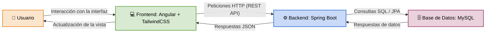
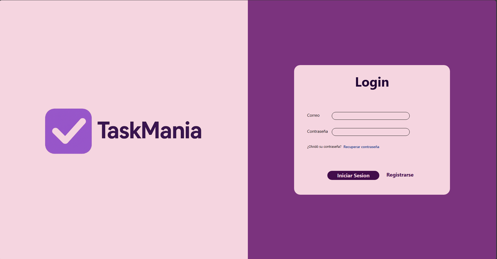
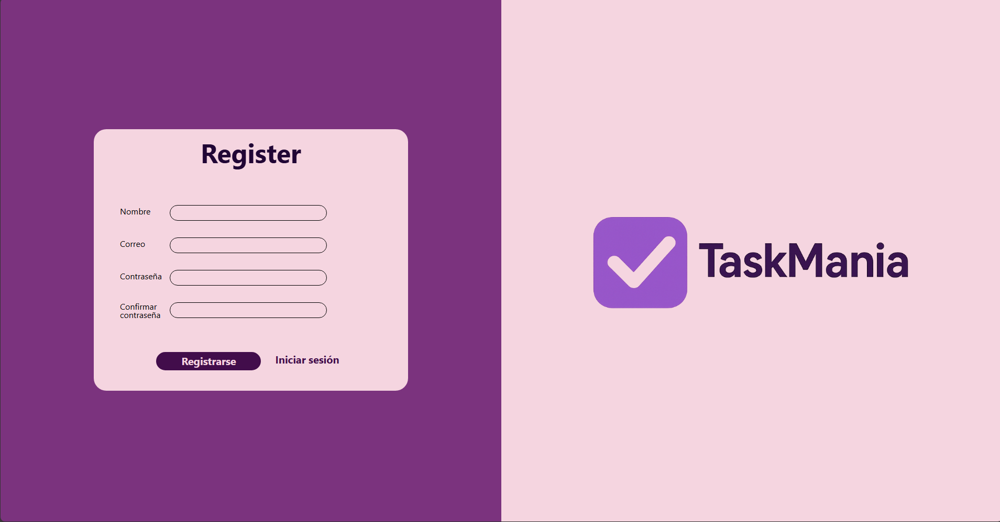
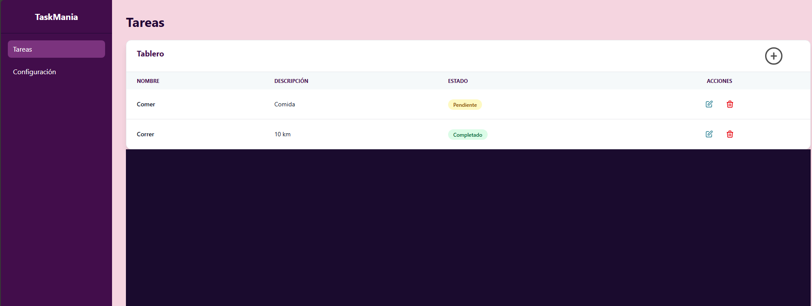
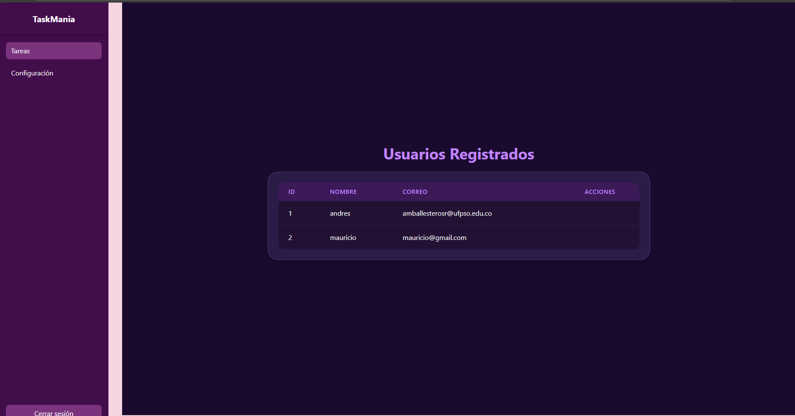

#  TaskMania

##  Descripción general del sistema
**TaskMania** es una aplicación web diseñada para la **gestión eficiente de tareas personales**.  
Permite a los usuarios **crear, editar, eliminar y visualizar tareas**, además de **registrarse e iniciar sesión** de forma segura mediante un sistema de autenticación completo.  

El sistema también incluye un módulo administrativo que muestra una **tabla con los usuarios registrados**, facilitando así el monitoreo de la información.  
La aplicación se desarrolló bajo un enfoque de arquitectura **cliente-servidor**, donde el **frontend** se conecta al **backend** a través de peticiones HTTP.

---

##  Integrantes del equipo

- **Eduardo José Gutiérrez De Piñérez Dizeo**  
  - **Frontend:** Desarrollo de las vistas de *Login*, *Registro*, y todas las vistas relacionadas con la gestión de tareas (tabla principal, creación y edición).  
  - **Backend:** Implementación completa del **CRUD de tareas**.

- **Andrés Mauricio Ballesteros Rincón**  
  - **Frontend:** Desarrollo de las vistas de *Recuperar contraseña* y *Dashboard*, además de la sección de **listado de usuarios**.  
  - **Backend:** Implementación completa del **CRUD de usuarios** y la **autenticación funcional** en *Login* y *Registro*.

---

##  Objetivo del proyecto

El objetivo principal de **TaskMania** es **desarrollar un sistema web completo e integrado** que permita gestionar tareas de manera sencilla y eficiente.  
El sistema busca ofrecer una experiencia fluida al usuario mediante una interfaz intuitiva, un backend robusto y una base de datos optimizada.  
Además, se busca fomentar la comprensión práctica de una **arquitectura full stack moderna**, integrando tecnologías de frontend, backend y servicios en la nube.

---

##  Arquitectura general del sistema

La arquitectura de **TaskMania** sigue un modelo **cliente-servidor** con tres capas principales:

1. **Frontend (Angular + TailwindCSS):**  
   Interfaz visual que permite al usuario interactuar con el sistema.  
   Envía solicitudes HTTP al backend y muestra las respuestas procesadas.

2. **Backend (Spring Boot):**  
   Procesa las solicitudes del frontend, aplica las reglas de negocio y gestiona la comunicación con la base de datos.

3. **Base de Datos (MySQL):**  
   Almacena la información persistente del sistema (usuarios, tareas, etc.), gestionada a través de JPA.

4. **Despliegue:**  
   - Frontend alojado en **Firebase Hosting** : https://taskmania-16283.web.app/auth/login
   - Backend y base de datos desplegados en **Railway** : https://backendtaskmania-production.up.railway.app

###  Diagrama general de la arquitectura

## Tecnologías utilizadas y dependencias

El proyecto **TaskMania** fue desarrollado utilizando un stack moderno basado en **Angular** para el frontend, **Spring Boot** para el backend y **MySQL** como base de datos relacional.  
Además, se emplearon servicios en la nube para el despliegue y almacenamiento, como **Firebase Hosting** y **Railway**.

---

### 🔹 Frontend

- **Framework principal:** Angular v19.2.0  
- **Estilos:** TailwindCSS v4.1.15  
- **Lenguaje:** TypeScript  
- **Gestión de dependencias:** npm  
- **Librerías adicionales:**
  - `rxjs` (~7.8.0) → manejo reactivo de datos  
  - `sweetalert2` (v11.26.3) → alertas y notificaciones personalizadas  
  - `@angular/forms` → validaciones reactivas  
  - `@angular/router` → navegación entre vistas  
  - `zone.js` → detección de cambios en Angular  
  - `@tailwindcss/postcss` y `postcss` → procesamiento de estilos

**Dependencias de desarrollo:**
- `@angular-devkit/build-angular` (v19.2.19)  
- `@angular/cli` (v19.2.12)  
- `typescript` (~5.7.2)  
- `karma` y `jasmine` → entorno de pruebas unitarias

---

### 🔹 Backend

- **Framework:** Spring Boot v3.5.5  
- **Lenguaje:** Java 21  
- **Sistema de construcción:** Maven  
- **Principales dependencias:**
  - `spring-boot-starter-web` → creación de controladores REST  
  - `spring-boot-starter-data-jpa` → persistencia con JPA/Hibernate  
  - `spring-boot-starter-validation` → validación de datos  
  - `spring-boot-starter-actuator` → monitoreo y métricas  
  - `mysql-connector-j` → conexión con MySQL  
  - `lombok` → simplificación de código (getters/setters automáticos)  
  - `spring-boot-starter-test` y `spring-security-test` → pruebas

**Plugins de compilación:**
- `maven-compiler-plugin` → configuración de Java 21  
- `maven-resources-plugin` → codificación UTF-8  
- `spring-boot-maven-plugin` → empaquetado del proyecto  

---

### 🔹 Base de Datos

- **Motor:** MySQL  
- **Tablas principales:**  
  - `users` → gestión de usuarios (registro, autenticación, roles)  
  - `tasks` → almacenamiento de las tareas creadas por los usuarios  
- **ORM:** Hibernate (implementación de JPA)  

---

### 🔹 Herramientas de despliegue

- **Firebase Hosting** → despliegue del frontend (Angular): https://angular.dev/
- **Railway** → alojamiento del backend (Spring Boot) y base de datos MySQL : https://railway.com/

## Requisitos previos / Dependencias

Antes de ejecutar el proyecto, asegúrate de contar con las herramientas y dependencias necesarias tanto para el frontend como para el backend y la base de datos.

---

### 🔹 Requisitos generales

- Sistema operativo: Windows, Linux o macOS
- Editor recomendado: Visual Studio Code, IntelliJ IDEA o Eclipse
- Conexión a internet: necesaria para instalar dependencias

---

### 🔹 Frontend (Angular)

- Node.js: v18 o superior
- npm: v9 o superior
- Angular CLI: v19.2.0 o superior
- Estilos: TailwindCSS v4.1.15
- Lenguaje: TypeScript

Instalación de dependencias y ejecución:

### Instalar dependencias
npm install

### Ejecutar servidor de desarrollo
ng serve

El frontend se ejecutará por defecto en http://localhost:4200

### Dependencias principales (según package.json):

"dependencies": {

  "@angular/common": "^19.2.0",

"@angular/compiler": "^19.2.0",

  "@angular/core": "^19.2.0",

  "@angular/forms": "^19.2.0",

  "@angular/platform-browser": "^19.2.0",

  "@angular/platform-browser-dynamic": "^19.2.0",

  "@angular/router": "^19.2.0",

  "@tailwindcss/postcss": "^4.1.15",

  "postcss": "^8.5.6",

  "rxjs": "~7.8.0",

  "sweetalert2": "^11.26.3",

  "tailwindcss": "^4.1.15",

  "tslib": "^2.3.0",

  "zone.js": "~0.15.0"

}

### Dependencias de desarrollo:

@angular-devkit/build-angular (v19.2.19)

@angular/cli (v19.2.12)

typescript (~5.7.2)

karma y jasmine → pruebas unitarias

---

### 🔹 Backend (Spring Boot)

- Java JDK: 21
- Sistema de construcción: Maven 3.9 o superior
- Framework: Spring Boot v3.5.5

Instalación de dependencias y ejecución:

### Instalar dependencias del proyecto
mvn install

### Ejecutar la aplicación Spring Boot
mvn spring-boot:run

El backend se ejecutará por defecto en http://localhost:8080

Dependencias principales (según pom.xml):

spring-boot-starter-web → creación de controladores REST

spring-boot-starter-data-jpa → persistencia con JPA/Hibernate

spring-boot-starter-validation → validación de datos

spring-boot-starter-actuator → monitoreo y métricas

mysql-connector-j → conexión con MySQL

lombok → simplificación de código (getters/setters automáticos)

spring-boot-starter-test y spring-security-test → pruebas

## Plugins de compilación importantes:

maven-compiler-plugin → configuración de Java 21

maven-resources-plugin → codificación UTF-8

spring-boot-maven-plugin → empaquetado del proyecto

Configuración de la base de datos (application.properties):

spring.datasource.url=jdbc:mysql://localhost:3306/taskmania_db
spring.datasource.username=root
spring.datasource.password=
spring.jpa.hibernate.ddl-auto=update
spring.jpa.show-sql=true
spring.jpa.properties.hibernate.dialect=org.hibernate.dialect.MySQL8Dialect

---

### 🔹 Base de Datos (MySQL)

- Motor: MySQL (XAMPP o instalación local)
- Usuario: root
- Contraseña: (vacía por defecto)
- Base de datos: taskmania_db

Tablas principales:

users → gestión de usuarios (registro, autenticación, roles)
tasks → almacenamiento de las tareas creadas por los usuarios

Asegúrate de iniciar el servidor MySQL antes de ejecutar el backend para evitar errores de conexión.

🖥️ Backend (Spring Boot)

El backend de TaskMania fue desarrollado utilizando Spring Boot v3.5.5, bajo una arquitectura RESTful.
Su función principal es gestionar la lógica de negocio del sistema, procesar las solicitudes HTTP provenientes del frontend y comunicarse con la base de datos MySQL para almacenar y recuperar información.

Características principales

API REST con controladores para usuarios y tareas.

Sistema de autenticación mediante JWT (JSON Web Tokens).

Gestión de roles y permisos (usuario y administrador).

Manejo de excepciones personalizadas.

Conexión segura con MySQL mediante JPA/Hibernate.

Estructura básica de paquetes
src/
 └── main/
      ├── java/com/taskmania/
      │    ├── controller/     → Controladores REST (UserController, TaskController)
      │    ├── model/          → Entidades JPA (User, Task)
      │    ├── repository/     → Interfaces de persistencia (UserRepository, TaskRepository)
      │    ├── service/        → Lógica de negocio (UserService, TaskService)
      │    ├── security/       → Configuración JWT y filtros de autenticación
      │    └── TaskmaniaApplication.java → Clase principal del proyecto
      └── resources/
           ├── application.properties   → Configuración de la base de datos y servidor
           └── static/ y templates/     → Recursos adicionales (si aplica)

💻 Frontend (Angular)

El frontend fue desarrollado con Angular v19.2.0 y TailwindCSS, ofreciendo una interfaz moderna, responsiva y centrada en la experiencia del usuario.
Se conecta al backend mediante servicios HTTP, consumiendo los endpoints REST y mostrando los datos de forma dinámica.

Características principales

Módulos independientes para autenticación y gestión de tareas.

Sistema de rutas con protección mediante AuthGuard.

Formularios reactivos con validaciones.

Notificaciones personalizadas con SweetAlert2.

Modo oscuro y diseño moderno con TailwindCSS.

Estructura general del frontend
src/
 ├── app/
 │    ├── auth/               → Login, registro y recuperación de contraseña
 │    ├── dashboard/          → Vista principal con las tareas del usuario
 │    ├── users/              → Listado y gestión de usuarios (solo admin)
 │    ├── services/           → Servicios que consumen la API (user.service.ts, task.service.ts)
 │    ├── guards/             → Protección de rutas (auth.guard.ts)
 │    ├── components/         → Componentes reutilizables
 │    └── app-routing.module.ts / app.module.ts
 ├── assets/                  → Recursos estáticos (logos, íconos, etc.)
 ├── environments/            → Configuración de entornos (API_URL)
 └── index.html / main.ts     → Archivos raíz del proyecto Angular

🗄️ Base de Datos (Configuración)

Motor: MySQL
Nombre: taskmania_db

Tablas principales
🧍 users
Campo	Tipo	Descripción
id	INT (PK, autoincrement)	Identificador único del usuario
username	VARCHAR	Nombre de usuario
email	VARCHAR	Correo electrónico
password	VARCHAR	Contraseña encriptada
role	VARCHAR	Rol del usuario (USER / ADMIN)
created_at	DATETIME	Fecha de creación
📝 tasks
Campo	Tipo	Descripción
id	INT (PK, autoincrement)	Identificador único de la tarea
title	VARCHAR	Título de la tarea
description	TEXT	Descripción detallada
status	VARCHAR	Estado de la tarea (pendiente, completada, etc.)
user_id	INT (FK → users.id)	Usuario propietario
created_at	DATETIME	Fecha de creación
updated_at	DATETIME	Última actualización
Configuración en application.properties
spring.datasource.url=jdbc:mysql://localhost:3306/taskmania_db
spring.datasource.username=root
spring.datasource.password=
spring.jpa.hibernate.ddl-auto=update
spring.jpa.show-sql=true
spring.jpa.properties.hibernate.dialect=org.hibernate.dialect.MySQL8Dialect
server.port=8080

🌐 Endpoints principales del Backend
🔹 Autenticación (UserController)
Método	Endpoint	Descripción
POST	/user/auth/register	Registro de nuevo usuario
POST	/user/auth/login	Inicio de sesión y generación de token JWT
GET	/user/list	Obtiene todos los usuarios (solo admin)
🔹 Tareas (TaskController)
Método	Endpoint	Descripción
GET	/task/all	Lista todas las tareas del usuario autenticado
POST	/task/create	Crea una nueva tarea
PUT	/task/update/{id}	Actualiza una tarea existente
DELETE	/task/delete/{id}	Elimina una tarea por ID
🖼️ Capturas de Pantalla del Sistema en Funcionamiento

Pantalla de Login:

Pantalla de Registro:

Dashboard (Gestión de tareas):

Vista de Usuarios (Administrador):

📂 Estructura de Carpetas del Proyecto (Resumen Global)
TaskMania/
 ├── backend/
 │    ├── src/
 │    └── pom.xml
 │
 ├── frontend/
 │    ├── src/
 │    └── angular.json
 │
 ├── base_de_datos/
 │    └── script_taskmania.sql
 │
 ├── documentación/
 │    ├── Parte1.md
 │    └── Parte2.md
 │
 └── README.md